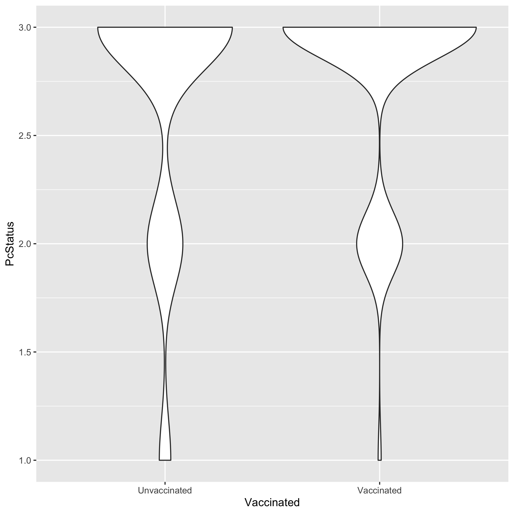
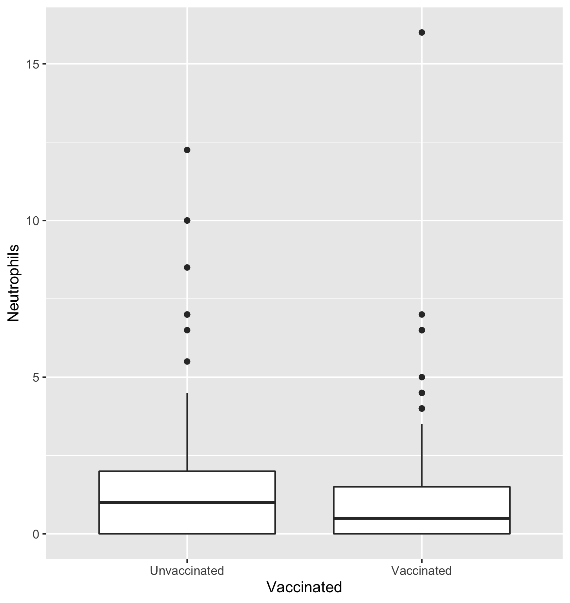

# Summary/Abstract
_Pneumocystis jirovecii_ (Pc) is an opportunistic fungal infection, primarily associated with an AIDS diagnosis. However, constant monitoring shows healthy and HIV+ indviduals lacking other diagnostic criteria are also transiently colonized with Pc, and demonstrate capability of clearing this infection before it develops into an intersitial pneumonia. In this analysis, the efficacy of experimental vaccination was evaluated and found to significantly reduce incidence of pnuemonia. While colonization with _Pneumocystis_ is not reduced, vaccinated NHPs who are colonized have 0.21 times the risk of progressing in to PCP compared to unvaccinated. Furthermore, CD4+ T cell count serves as a significant factor in determining those that will progress from colonization to pneumonia and those that will maintain or clear the infection. 


# Introduction 

## Background
_Pneumocystis jirovecii_ (Pc) is the causative agent of an interstitial pneumonia in immunocompromised populations, inclulding those with HIV, transplant recipients, and cancer patients undergoing chemotherapy or radiation treatments. Pc presents a number of clinical issues including a lack of FDA-approved vaccines and limited treatment options._

Among the issues associated with Pc infection, it is difficult to determine the incidence of this infection because of a lack of clear diagnostics. Unlike most bacterial and fungal infections, Pc cannot be cultured for infection confirmation. Instead, diganosis is reliant on a combination of parameters including sampling of bronchoalveolar lavage fluid (BALF) for PCR, cell differential, and smear. Additionally, analysis of criteria of the immunecompromised status, such as CD4+ T cell count in HIV+ individuals or transplant recipients, may provide additional information.

The story is further complicated by the fact that healthy and HIV+/non-AIDS patients can be transiently colonized and can appropriately clear the infection. 
In this analysis, the relationship of all Pc diagnostic criteria will be examined in relationship to the most reliable diagnostic criteria (PCR) to capture the immune system response to colonization and fulminant pneumonia.   

## Description of data and data source
This data set has been generated from a number of studies in a non-human primate model of HIV and Pc co-infection (n=30). Data was collected prior to and following infection with Simian Immunodeficiency Virus (SIV) through ~40 weeks post infection. 

The data collected includes:

### 1. _Pneumocystis_ diagnosis from bronchoalveolar lavage fluid (BALF)

  A. PCR status:
   
    i. First round positive (deemed equivalent to pneumonia)
    ii. Second round positive (equivalent to colonization)
    iii. Negative 
   
  B. BALF differential for neutrophil count (marker for infection)

  C. BALF Smear
    
    i. Positive (evidence of cysts or trophs)
    ii. Inflammation (foamy exudate)
    iii. Clear

### 2. Immune System Status
  
  A. Lymphocyte Count
  
  B. CD4+ T cell count
  
  C. Viral Load
  
  D. Vaccine Status


## Questions to be addressed

  1. Does experimental vaccination reduce the incidence of Pc in this cohort?

  2. Are there predictive diagnostic criteria in transient vs. progressive _Pneumocystis_ infection?


# Methods and Results

## Data aquisition
This data is generated from results gathered by the Norris Lab at the University of Georgia. 

## Data import and cleaning
As this is a data set that I put together from results generated in our lab, I conducted the majority of the cleaning during the formatting process and before it was imported into R. I checked to make sure the Excel file was readable in the processingscript.R document. 

## Univariate analysis
### Exploring the Pc Diagnostic Variables by Identifier
This is a summary of the values of the Pc diagnostic variables by identifier.
```{r resulttable1,  fig.cap='Summary of Characteristics by Individual', echo=FALSE}

```

While this information will be useful to us moving forward, it is difficult to make any conclusions with the data in this format. 

### Exploring the Pc Diagnostic Variables by Vaccine Status
This is to get first impressions of differences in the vaccinated and unvaccinated populations in a first attempt to answer question 1. 
```{r resulttable2,  fig.cap='Summary of Characteristics by Vaccine Status', echo=FALSE}

```

We can start to see that there are differences in our vaccinated and unvaccinated cohorts. Neutrophils (a cell type that serves as a major marker for infection) are reduced in the vaccinated cohort and their Pc status is scored more closely to 3 (Pc-free) than the unvaccinated. Understanding if these differences are significant will be useful in drawing conclusions about the relationship between vaccination and Pc infection. 

## Bivariate analysis 
### Does Vaccination Reduce the Incidence of Pc?
In this section, we want to start fully addressing the three questions set out in the in the beginning of this report. When starting to address our questions, we want to plot the data to get a sense of what is there. First and foremost, we want to adress is experimental vaccination reduces the incidence of Pc in this cohort.

```{r resultfigure1,  fig.cap='Vaccination reduces Pc Incidence', echo=FALSE}

```

We can see here that our vaccinated cohort has lower incidence of Pc when plotted. We can see smaller numbers at the 1 and 2 (more severe) categorizations in this cohort. We will evaluate in the full analysis if this is a significant difference. 

### Does Vaccination also affect other major markers of infection?
Neutrophil count is our major marker for an active infection so we also want to see if vaccination status will have a significant effect on other markers of Pc. 

```{r resultfigure2,  fig.cap='Vaccination reduces active infection', echo=FALSE}

```

We can see here that our vaccinated population also has a lower distribution of neutrophils across the course of the studies. This further supports the results seen in the previous figure. 

### Can we confirm that Pc status is associated with markers of infection?
This is a brief display of the relationship between Pc Status and Neutrophil Count. We can see that as Pc status gets categorized more highly (greater disease), measured neutrophil count increases. 
```{r resultfigure3,  fig.cap='Pc Status is associated with Neutrophil Count', echo=FALSE}
knitr::include_graphics("../../results/resultfigure.png")
```


## Full analysis 
### Question 1: Does experimental vaccination reduce the incidence of Pc in this cohort?
  In order to answer the first question regarding the incidence of _Pneumocystis_ and pneumonia in this cohort, we will turn to a surivival curve plotting the incidence of the pneumonia in the vaccinated and unvaccinated cohorts.
```{r resultfigure4,  fig.cap='Survival Curve from PCP', echo=FALSE}

```

With a p-value of 0.0489 by Mantel-Cox, vaccination significantly reduces the incidence of PCP in these cohorts. This is crucial in reducing mortality but colonization with _Pneumocystis_ (or a 2 in Pc Status) can also play a long-term role in the health of the individual. We next examined differences in the survival curves with colonization, defined as being a Pc Status of 2 at two consecutive timepoints. 

```{r resultfigure5,  fig.cap='Survival Curve from Colonization', echo=FALSE}

```

As is evident from the graph and from a p-value of 0.498 by Mantel-Cox, vaccination does significantly reduce colonization with _Pneumocystis_. 

However, we can see the relationship of colonization and vaccination when examining progression from colonization into pneumonia (Progressive phenotype) compared to resolving or maintaining colonization (Transient phenotype). 

```{r resultfigure6,  fig.cap='Relative Risk', echo=FALSE}

```

As we can see here, vaccinated animals have 0.18 times the risk of progressing into PCP compared to unvaccinated animals (p=0.0406). 

### Question 2: Are there predictive diagnostic criteria in transient vs. progressive _Pneumocystis_ infection?

From the animals that were identified as being progressive or transiently colonized with _Pneumocystis_, the surrounding data points (from the time of colonization to the time of resolution or progression to PCP) were compared using t-tests for differences in other population information and diagnostic criteria.

```{r resultfigure7,  fig.cap='Comparing Diagnostic Factors', echo=FALSE}
knitr::include_graphics("../../results/table4.png")
```

As we can see, the only significant difference in diagnostic and predictive factors is in lymphocyte and CD4+ T cell counts. Due to the fact that CD4+ T cell count is generated from the overall lymphocyte population, these two values are closely intertwined. 

# Discussion

## Summary and Interpretation
This data analysis served to examine the relationship between vaccination, _Pneumocystis_ diagnosis, and the secondary diagnostic markers. To address the first question, experimental vaccination does reduce the incidence of _Pneumocystis_ pneumonia (p=0.0489) but does not significantly alter colonization in this cohort (p=0.498). However, vaccination did seem to have a signficant relationship with changing the course of colonization. As we can see in Table 3, vaccinated animals had 0.21 times the risk of progressing into PCP compared the unvaccinated cohort (p=0.0406). 
In further trying to elucidate the difference between transient and progressive phenotypes, the only other factor, aside from vaccination status, that significantly differed between the two was lymphocyte and CD4+ T cell count. As these values indicate overall immunsuppression levels, it is unsuprising that animals with significantly lower lymphocyte and CD4+ counts developed PCP but CD4+ T cell count at the time of colonization may serve as important indicator for intervention to prevent fulminant pneumonia. It is worth noting that there was not a signficant difference in CD4+ T cell count between the vaccinated and unvaccinated cohorts (p=0.207). 

## Strengths and Limitations
This analysis included several limitations, the first of which is that this data set was relatively small with incomplete individual data points. Furthermore, diagnosis of _Pneumocystis_ lacks a definitive test and these results rely upon PCR, which is somewhat variable is success. **At this time, some of my analysis has been conducted in Prism and saved as an image due to an inability to format these analyses correctly. This will be amended by the final draft. 

The strength of this analysis is that it is the first to take an in-depth look at the diagnostic markers for _Pneumocystis_ infection. As related human cohorts are nearly impossible to study long term due to the invaive nature of diagnosis, this data set also represents one of the most complete set of data on this subject.  

## Conclusions
Experimental vaccination reduces the incidence of _Pneumocystis_ pneumonia in a non-human primate model of HIV. While colonization with _Pneumocystis_ is not reduced, vaccinated NHPs who are colonized have 0.21 times the risk of progressing in to PCP compared to unvaccinated. Furthermore, CD4+ T cell count serves as a significant factor in determining those that will progress from colonization to pneumonia and those that will maintain or clear the infection. 


