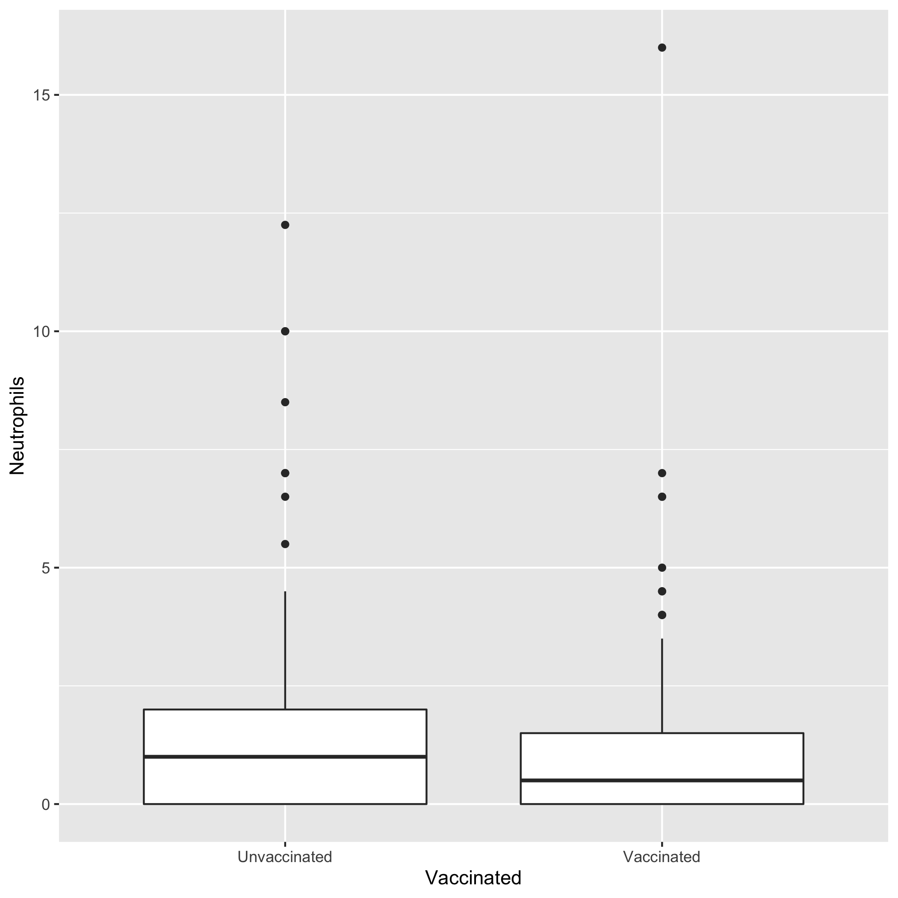

# Summary/Abstract
_Pneumocystis jirovecii_ (Pc) is an opportunistic fungal infection, primarily associated with an AIDS diagnosis. However, constant monitoring shows healthy and HIV+ indviduals lacking other diagnostic criteria are also transiently colonized with Pc, and demonstrate capability of clearing this infection before it develops into an intersitial pneumonia. In this analysis, the diagnosis of Pc through PCR was compared to the other diagnostic criteria to more accurately capture the relationship of these criteria to the transient colonization of Pc. Hopefully we find something. 


# Introduction 

## Background
_Pneumocystis jirovecii_ (Pc) is the causative agent of an interstitial pneumonia in immunocompromised populations, inclulding those with HIV, transplant recipients, and cancer patients undergoing chemotherapy or radiation treatments. Pc presents a number of clinical issues including a lack of FDA-approved vaccines and limited treatment options._

Among the issues associated with Pc infection, it is difficult to determine the incidence of this infection because of a lack of clear diagnostics. Unlike most bacterial and fungal infections, Pc cannot be cultured for infection confirmation. Instead, diganosis is reliant on a combination of parameters including sampling of bronchoalveolar lavage fluid (BALF) for PCR, cell differential, and smear. Additionally, analysis of criteria of the immunecompromised status, such as CD4+ T cell count in HIV+ individuals or transplant recipients, may provide additional information.

The story is further complicated by the fact that healthy and HIV+/non-AIDS patients can be transiently colonized and can appropriately clear the infection. 
In this analysis, the relationship of all Pc diagnostic criteria will be examined in relationship to the most reliable diagnostic criteria (PCR) to capture the immune system response to colonization and fulminant pneumonia.   

## Description of data and data source
This data set has been generated from a number of studies in a non-human primate model of HIV and Pc co-infection (n=30). Data was collected prior to and following infection with Simian Immunodeficiency Virus (SIV) through ~40 weeks post infection. 

The data collected includes:

### 1. _Pneumocystis_ diagnosis from bronchoalveolar lavage fluid (BALF)

  A. PCR status:
   
    i. First round positive (deemed equivalent to pneumonia)
    ii. Second round positive (equivalent to colonization)
    iii. Negative 
   
  B. BALF differential for neutrophil count (marker for infection)

  C. BALF Smear
    
    i. Positive (evidence of cysts or trophs)
    ii. Inflammation (foamy exudate)
    iii. Clear

### 2. Immune System Status
  
  A. Lymphocyte Count
  
  B. CD4+ T cell count
  
  C. Viral Load
  
  D. Vaccine Status


## Questions to be addressed

  1. Does experimental vaccination reduce the incidence of Pc in this cohort?

  2. Are there predictive diagnostic criteria in transient vs. progressive _Pneumocystis_ infection?

  3. Are there immune changes of note related to Pc colonization or infection?


# Methods and Results

## Data aquisition
This data is generated from results gathered by the Norris Lab at the University of Georgia. 

## Data import and cleaning
As this is a data set that I put together from results generated in our lab, I conducted the majority of the cleaning during the formatting process and before it was imported into R. I checked to make sure the Excel file was readable in the processingscript.R document. 

## Univariate analysis
### Exploring the Pc Diagnostic Variables by Identifier
This is a summary of the values of the Pc diagnostic variables by identifier.
```{r resulttable1,  fig.cap='Table 1: Summary of Characteristics by Individual', echo=FALSE}
knitr::include_graphics("../../results/resulttable.png")
```
While this information will be useful to us moving forward, it is difficult to make any conclusions with the data in this format. 

### Exploring the Pc Diagnostic Variables by Vaccine Status
This is to get first impressions of differences in the vaccinated and unvaccinated populations in a first attempt to answer question 1. 
```{r resulttable2,  fig.cap='Table 1: Summary of Characteristics by Vaccine Status', echo=FALSE}
knitr::include_graphics("../../results/resulttable2.png")
```

We can start to see that there are differences in our vaccinated and unvaccinated cohorts. Neutrophils (a cell type that serves as a major marker for infection) are reduced in the vaccinated cohort and their Pc status is scored more closely to 3 (Pc-free) than the unvaccinated. Understanding if these differences are significant will be useful in drawing conclusions about the relationship between vaccination and Pc infection. 

## Bivariate analysis 
### Does Vaccination Reduce the Incidence of Pc?
In this section, we want to start fully addressing the three questions set out in the in the beginning of this report. When starting to address our questions, we want to plot the data to get a sense of what is there. First and foremost, we want to adress is experimental vaccination reduces the incidence of Pc in this cohort.

```{r resultfigure1,  fig.cap='Figure 1: Vaccination reduces Pc Incidence', echo=FALSE}
knitr::include_graphics("../../results/resultfigure3.png")
```

We can see here that our vaccinated cohort has lower incidence of Pc when plotted. We can see smaller numbers at the 1 and 2 (more severe) categorizations in this cohort. We will evaluate in the full analysis if this is a significant difference. 

### Does Vaccination also affect other major markers of infection?
Neutrophil count is our major marker for an active infection so we also want to see if vaccination status will have a significant effect on other markers of Pc. 

```{r resultfigure2,  fig.cap='Figure 2: Vaccination reduces active infection', echo=FALSE}

```
We can see here that our vaccinated population also has a lower distribution of neutrophils across the course of the studies. This further supports the results seen in the previous figure. 

### Can we confirm that Pc status is associated with markers of infection?
This is a brief display of the relationship between Pc Status and Neutrophil Count. We can see that as Pc status gets categorized more highly (greater disease), measured neutrophil count increases. 
```{r resultfigure3,  fig.cap='Figure 3: Pc Status is associated with Neutrophil Count', echo=FALSE}
knitr::include_graphics("../../results/resultfigure.png")
```


## Full analysis (Part 4)
_Use one or several suitable statistical/machine learning methods to analyze your data and to produce meaningful figures, tables, etc. This might again be code that is best placed in one or several separate R scripts that need to be well documented. You can then load the results produced by this code_

# Discussion

## Summary and Interpretation
  1. Does experimental vaccination reduce the incidence of Pc in this cohort?

  2. Are there predictive diagnostic criteria in transient vs. progressive _Pneumocystis_ infection?

  3. Are there immune changes of note related to Pc colonization or infection?

## Strengths and Limitations
_Discuss what you perceive as strengths and limitations of your analysis._

## Conclusions
_What are the main take-home messages?_


_Include citations in your Rmd file using bibtex, the list of references will automatically be placed at the end_

# References

# Ongoing Issues:
Displaying a simple table in the univariate analysis section. The tables look as I expect in RStudio but it does not appear that way in the output. 