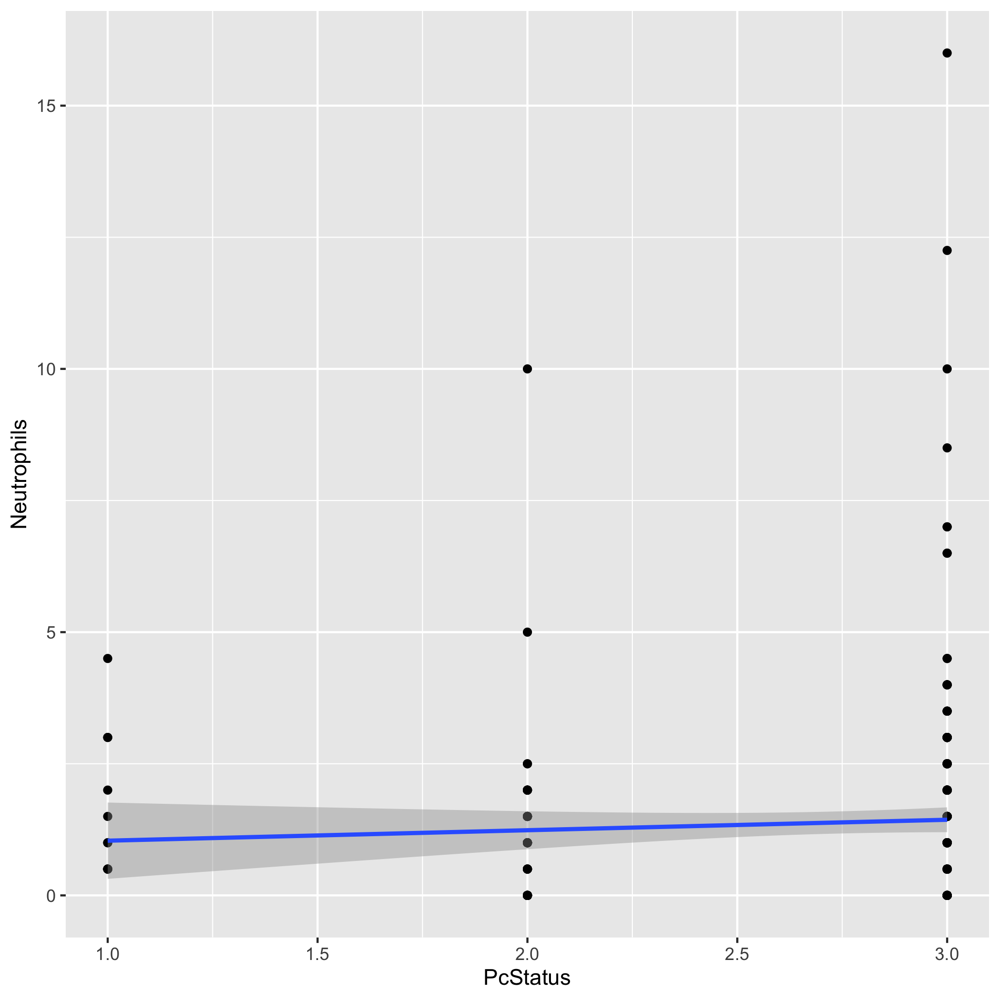

# Summary/Abstract
_Pneumocystis jirovecii_ (Pc) is an opportunistic fungal infection, primarily associated with an AIDS diagnosis. However, constant monitoring shows healthy and HIV+ indviduals lacking other diagnostic criteria are also transiently colonized with Pc, and demonstrate capability of clearing this infection before it develops into an intersitial pneumonia. In this analysis, the diagnosis of Pc through PCR was compared to the other diagnostic criteria to more accurately capture the relationship of these criteria to the transient colonization of Pc. Hopefully we find something. 

# Illustrating setup
_This section is only there to show how to insert results from other places in the project and how to cite figures and other references. Delete this whole section at some point._


This paper [@Leek2015a] discusses types of analyses. 


Figure \@ref(fig:resultfigure) shows a result figure from the analysis.

```{r resultfigure,  fig.cap='Analysis figure.', echo=FALSE}

```

Table \@ref(tab:resulttable) shows a result table from the analysis.

```{r resulttable,  echo=FALSE}
resulttable=readRDS("../../results/resulttable.rds")
knitr::kable(resulttable, caption = 'Result Table.')
```


Note that this cited reference will show up at the end of the document, the reference formatting is determined by the CSL file specified in the YAML header. Many more style files for almost any journal [are available](https://www.zotero.org/styles). You also specify the location of your bibtex reference file in the YAML. You can call your reference file anything you like, I just used the generic word `references.bib` but giving it a more descriptive name is probably better.


# Introduction (required for part 1)

## Background
_Pneumocystis jirovecii_ (Pc) is the causative agent of an interstitial pneumonia in immunocompromised populations, inclulding those with HIV, transplant recipients, and cancer patients undergoing chemotherapy or radiation treatments. Pc presents a number of clinical issues including a lack of FDA-approved vaccines and limited treatment options._

Among the issues associated with Pc infection, it is difficult to determine the incidence of this infection because of a lack of clear diagnostics. Unlike most bacterial and fungal infections, Pc cannot be cultured for infection confirmation. Instead, diganosis is reliant on a combination of parameters including sampling of bronchoalveolar lavage fluid (BALF) for PCR, cell differential, and smear. Additionally, analysis of criteria of the immunecompromised status, such as CD4+ T cell count in HIV+ individuals or transplant recipients, may provide additional information.

The story is further complicated by the fact that healthy and HIV+/non-AIDS patients can be transiently colonized and can appropriately clear the infection. 
In this analysis, the relationship of all Pc diagnostic criteria will be examined in relationship to the most reliable diagnostic criteria (PCR) to capture the immune system response to colonization and fulminant pneumonia.   

## Description of data and data source
This data set has been generated from a number of studies in a non-human primate model of HIV and Pc co-infection. Data was collected prior to and following infection with Simian Immunodeficiency Virus (SIV) through ~40 weeks post infection. 

The data collected includes:

### 1. _Pneumocystis_ diagnosis from bronchoalveolar lavage fluid (BALF)

  A. PCR status:
   
    i. First round positive (deemed equivalent to pneumonia)
    ii. Second round positive (equivalent to colonization)
    iii. Negative 
   
  B. BALF differential for neutrophil count (marker for infection)

  C. BALF Smear
    
    i. Positive (evidence of cysts or trophs)
    ii. Inflammation (foamy exudate)
    iii. Clear

### 2. Immune System Status
  
  A. Lymphocyte Count
  
  B. CD4+ T cell count
  
  C. Viral Load
  
  D. Vaccine Status


## Questions to be addressed

  1. Does experimental vaccination reduce the incidence of Pc in this cohort?

  2. Are there predictive diagnostic criteria in transient vs. progressive _Pneumocystis_ infection?

  3. Are there immune changes of note related to Pc colonization or infection?


# Methods and Results

_In most research papers, results and methods are separate. You can combine them here if you find it easier. You are also welcome to structure things such that those are separate sections._


## Data aquisition
_As applicable, explain where and how you got the data. If you directly import the data from an online source, you can combine this section with the next._

## Data import and cleaning
_Write code that reads in the file and cleans it so it's ready for analysis. Since this will be fairly long code for most datasets, it might be a good idea to have it in one or several R scripts. If that is the case, explain here briefly what each file does. The files themselves should be commented well so everyone can follow along._

## Univariate analysis
_Use a combination of text/tables/figures to explore and describe your data. You should produce plots or tables or other summary quantities for most of your variables. You definitely need to do it for the important variables, i.e. if you have main exposure or outcome variables, those need to be explored. Depending on the total number of variables in your dataset, explore all or some of the others._

## Bivariate analysis
_Create plots or tables and compute simple statistics (e.g. t-tests, simple regression model with 1 predictor, etc.) to look for associations between your outcome(s) and each individual predictor variable_


## Full analysis
_Use one or several suitable statistical/machine learning methods to analyze your data and to produce meaningful figures, tables, etc. This might again be code that is best placed in one or several separate R scripts that need to be well documented. You can then load the results produced by this code_

# Discussion

## Summary and Interpretation
_Summarize what you did, what you found and what it means._

## Strengths and Limitations
_Discuss what you perceive as strengths and limitations of your analysis._

## Conclusions
_What are the main take-home messages?_


_Include citations in your Rmd file using bibtex, the list of references will automatically be placed at the end_

# References

